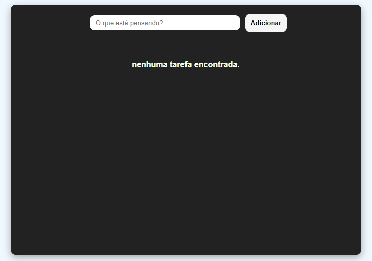
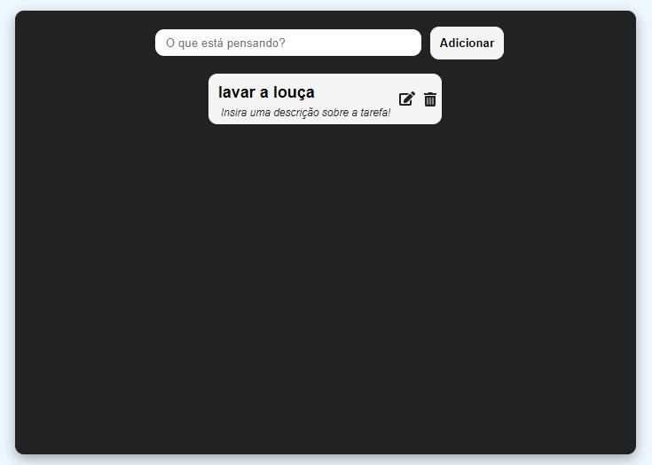
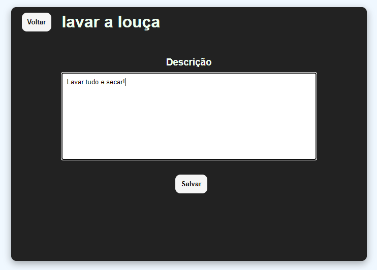
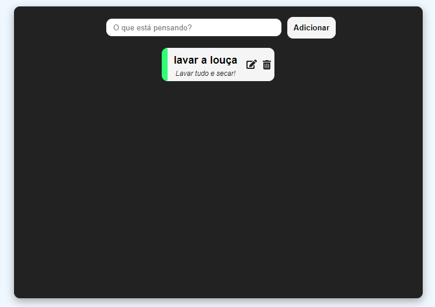

# Make-you-task
  Projeto pessoal feito para praticar Vue.js
  
# Screenshots
 
*Ao abrir pela primeira vez.*

 
*Adicionando uma tarefa.*

 
*Adicionando uma descrição a tarefa.*

 
*Marcando a tarefa como concluída.*
